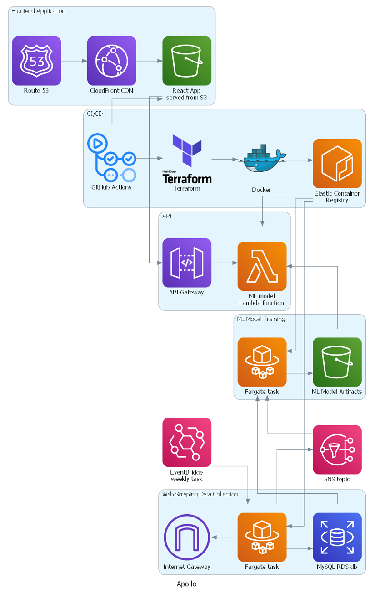

# Apollo
## Watch Pricing Engine - get your watch valuated!
> Monorepo for the apollo project


## Components
### Scraper:
Web scraping engine and database model using mostly ```sqlmodel``` and ```BeatifulSoup``` to build a MySQL database dataset from a popular eCommerce store.

### Modeller:
Automated machine Learning model builder, using ```TensorFlow```, ```LightGBM``` and ```Optuna```. Queries the aformentioned database for training data, and pushes model artifacts to AWS S3.

### Inference:
Backend API using ```fastapi```, ```LightGBM``` and ```TensorFlow```. Reads the ML model artifacts from S3 and serves them with a RESTful API to be queried by the frontend.

### Frontend:
Frontend application built with React.js and TypeScript and styled using MaterialUI. Sends requests to the Inference API with user's data to retrieve a price prediction.


## Project architecture
Diagram generated using [`diagrams`](https://diagrams.mingrammer.com/) python library

